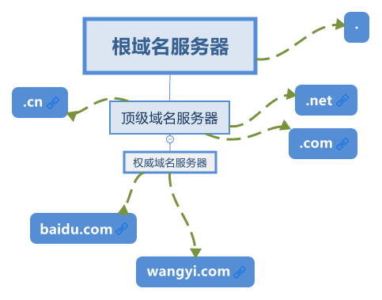
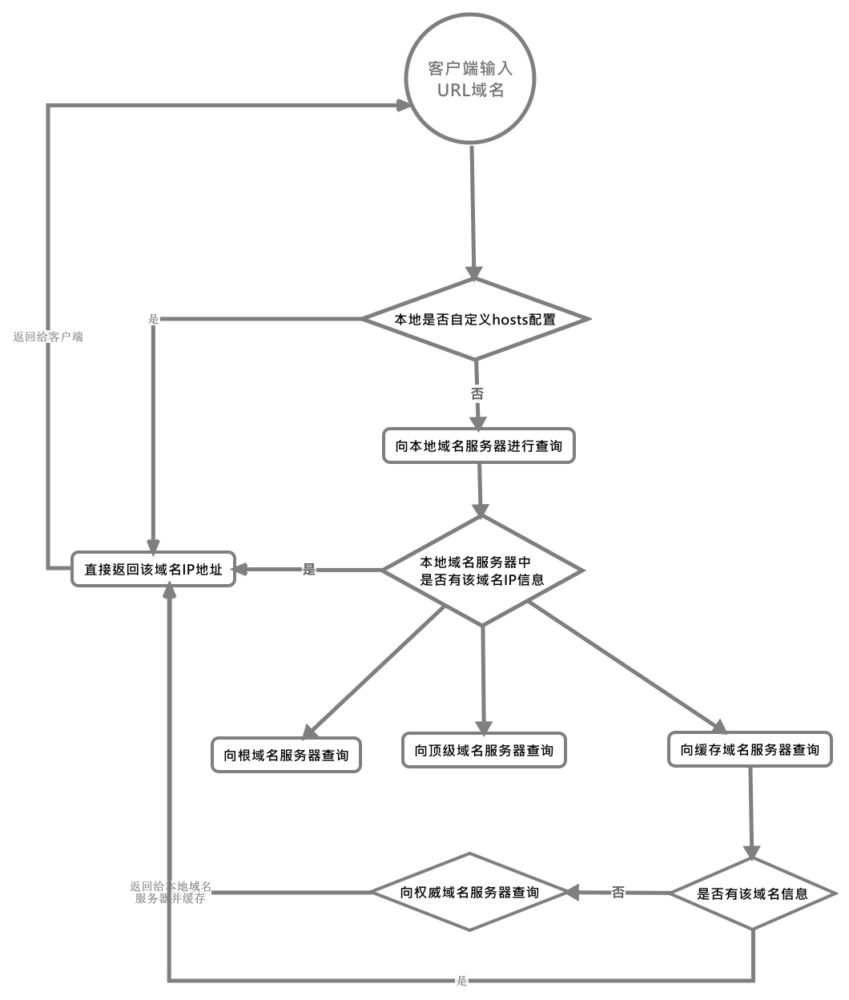
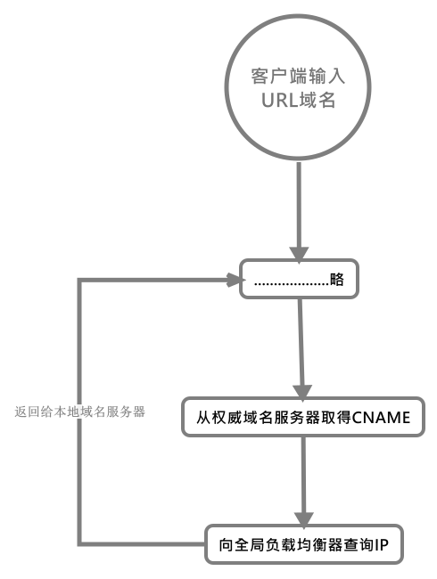

# DNS

## DNS服务器分类
DNS规范规定了2种类型的DNS服务器，一个叫主DNS服务器，一个叫辅助DNS服务器。在一个区中主DNS服务器从自己本机的数据库中读取该区的DNS数据信息，而辅助DNS服务器则从区中的主DNS服务器中读取该区的DNS数据信息。当一个辅助DNS服务器启动时，它需要与主DNS服务器通信，并加载数据信息，这就叫做**区传送**（zone transfer）。这种情况下，使用TCP协议。

## DNS如何将域名解析为IP
1. 首先浏览器会先查询本地`hosts`文件是否存在自定义配置
2. 如没有，则会向本地域名服务器查询（本地域名服务器为网络运行商如电信移动）
3. 本地域名解析服务器先向缓存中查找是否有该域名IP信息
4. 如果本地域名服务器没有，则本地域名服务器会**迭代查询**，它会代表客户端向根域名服务器进行查询
5. 根域名服务器返回其域名所在的顶级域名地址
6. 本地域名服务器又向顶级域名服务器中查询该地址的二级域名
7. 最后本地域名服务器再向权威域名服务器查询该地址的三级域名
8. 如过有则直接返回`IP`，没有则报错

整个查询过程，客户端只发送了一次请求，查询过程由本地DNS服务器**递归查询**完成。

### 查询种类
+ **递归查询**：在DNS查询过程中，客户端向本地服务器进行查询后，如果未查询到，就由本地服务器作为客户端代替客户端向根域名、顶级域名、权威域名服务器进行查询。
+ **迭代查询**：在本地服务器向客户端向根域名、顶级域名、权威域名服务器进行查询的过程就是迭代查询，这个过程中的中间结果是某个域名服务器告诉本地服务器下一步该向谁进行查询。

## 全局负载均衡器GSLB

### 就近访问
>为了使应用保持高可用性，数据可能会部署在多个机房，每个机房都有自己的IP且它们有自己的运营商和地域。当我们作为用户去访问这些应用时，我们希望竟可能近地域同运营商访问该应用。

为了做到上述特点，我们需要借助全局负载均衡器。在本地服务器递归查询过程的最后一步权威域名服务器查询的过程中;为了实现就近访问，于是**该域名在权威域名服务器中配置的不是`IP`而是`CNAME`别名**，之后本地域名解析服务器继续请求全局负载均衡器，它收到请求后会查询请求它的本地运营商和地址来获取用户运营商和地址，找到符合此要求的`IP`后就返回给本地域名服务器，之后通过本地域名服务器返回给客户端。

过程：
1. 如上进行到权威域名服务器查询时
2. 从权威域名服务器中取出`CNAME`向全局负载均衡器进行查询
3. 获取就近运营商和地址的`IP`，返回给本地服务器
4. 返回给客户端

## 提问
1. **DNS在域名解析上用的UDP还是TCP协议，为什么？**
   域名解析用的是UDP协议，因为DNS协议的开始和结果就是一个请求和一个响应，如果我们选用TCP协议的话还要经历三次握手、数据发送、四次挥手等阶段，而选用UDP协议没有这些过程，且较快速，服务器不用负载太大，响应更迅速。

2. **DNS在区域传送时为什么用TCP协议？**
   主要出于两个原因：
   1. 辅域名服务器会定时向主域名服务器进行查询以便了解数据是否有变动。如有变动则会执行一次区域传送，进行数据同步。此时数据量一般较大，出于UDP协议报文大小限制。
   2. TCP提供可靠的连接，确保了数据的精准。

[参考1](https://zhuanlan.zhihu.com/p/79350395)
[参考2](https://www.cnblogs.com/wuyun-blog/p/8183234.html)