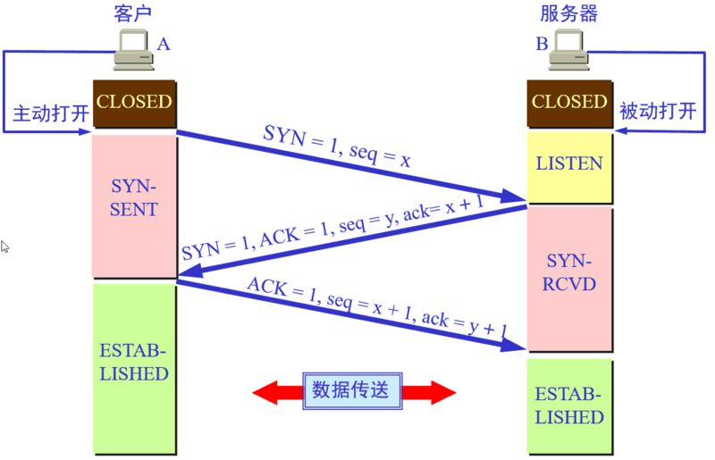

# TCP

## 三次握手过程

三次握手用于验证通信双方的收发数据能力。

1. 在第一次握手时，客户端生成一个随机数起始序列号，并向服务器端发送一个报文，报文段要包含`SYN = 1`标记，并且其`seq`序列号为刚刚的随机数。
2. 第二个次握手时，服务器收到客户端发送的报文，发现其`SYN = 1`，识别出其为连接请求，于是服务器端将该随机序列号(`seq`)存储起来，并且自己生成一个随机序列号。之后向客户端回复一个报文，回复的报文包含一个`SYN = 1`标志与一个i额`ACK = 1`标志加上刚刚生成的随机序列号`seq`与一个确认序列号`ack`(确认序列号即客户端发送的序列号+1)
3. 第三次握手  ，客户端收到服务器端发送的`ACK`与`ack`，得知服务器已收到报文；同时发现`SYN = 1`，得知服务器同意了此次连接，于是客户端再向服务器端发送一个报文，此报文包含一个`ACK`、一个`ack`(该确认报文段值等于第二次握手客户端发来的序列号 + 1)与一个`seq`(第一次握手发送的序列号+1)
4. 最后当服务器端收到该报文后，发现`ACK = 1`并且`ack`为自己发送的序列号+1，就知道客户端已收到了，此时`TCP`连接就已经建立了。

## 四次挥手的过程

四次挥手的目的是关闭一个连接。

1. 在第一次挥手时，客户端向服务器端发送连接释放报文(即标记`FIN = 1`)，并且带一个序列号。此时客户端不能继续发送数据，但可以正常接受数据。
2. 第二次挥手时，服务器收到客户端的连接释放报文后回复确认报文，确认报文的`ACK = 1`，并携带一个确认序列号`ack`(值为第一次挥手的序列号 +1)与一个序列化。此时服务器处于等待关闭状态，因为可能还存在未发送完的数据。
3. 第三次挥手时，服务器将最后的数据发送完毕后也向客户端发送一个连接释放报文(`FIN = 1`)，并标记`ACK = 1`，携带一个`ack`(值为第一次挥手的序列号+1)与一个新的序列号
4. 第四次挥手时，客户端收到服务器发送的连接释放报文后，向服务器发送确认报文(`ACK = 1`)，并携带`ack`(值为第三次挥手的序列号+1)与序列号(第一次挥手的序列号+1)。注意客户端发出确认报文后不是立马释放`TCP`连接，而是要经过`2MSL`(最长报文段寿命的2倍时长)后才释放`TCP`连接。而服务端一旦收到客户端发出的确认报文就会立马释放`TCP`连接，所以服务端结束`TCP`连接的时间要比客户端早一些。

## TCP的拥塞控制

为了防止网络的拥塞现象，TCP提出了一系列的拥塞控制机制。它们最早由**慢启动**`(Slow start)`与**拥塞避免**`(Congestion avoidance)`组成，之后又新加入**快速重传**`(Fast retransmit)`和**快速恢复**`(Fast Recovery)`算法，再之后加入了选择性应答算法`(selective acknowledgement,SACK)`。

`TCP`的拥塞控制主要原理依赖于一个拥塞窗口`(cwnd)`来控制，窗口值的大小就代表能够发送出去的但还没有收到`ACK`的最大数据报文段(接收端还有一个用于流量控制的接收窗口`rwnd`)，显然窗口越大数据发送的速度就越快，但也有可能使得网络出现拥塞。如果窗口值为1，那么就简化为一个停等协议，每发送一个数据，都要等到对方的确认才能发送第二个数据包，显然数据传输效率低下。`TCP`的拥塞控制算法就是要在这两者之间权衡，选取最好的`cwnd`值，从而使得网络吞吐量最大化且不产生拥塞。

**由于需要考虑拥塞控制和流量控制两个方面的内容，因此TCP的真正的发送窗口=min(rwnd, cwnd)**。但是`rwnd`是由对端确定的，网络环境对其没有影响，所以在考虑拥塞的时候我们一般不考虑`rwnd`的值，我们暂时只讨论如何确定`cwnd`值的大小。关于`cwnd`的单位，在TCP中是以字节来做单位的，我们假设TCP每次传输都是按照MSS大小来发送数据的，因此你可以认为`cwnd`按照数据包个数来做单位也可以理解，所以有时我们说`cwnd`增加1也就是相当于字节数增加1个MSS大小。

### 慢启动

最初的TCP在连接建立成功后会向网络中发送大量的数据包，这样很容易导致网络中路由器缓存空间耗尽，从而发生拥塞。因此新建立的连接不能够一开始就大量发送数据包，而只能根据网络情况逐步增加每次发送的数据量，以避免上述现象的发生。具体来说，当新建连接时，`cwnd`初始化为1个最大报文段(MSS)大小，发送端开始按照拥塞窗口大小发送数据，每当有一个报文段被确认，`cwnd`就增加1个MSS大小。这样`cwnd`的值就随着网络往返时间`(Round Trip Time,RTT)`呈指数级增长，事实上，慢启动的速度一点也不慢，只是它的起点比较低一点而已。

### 拥塞避免

慢启动不可能无限增长，当它到了一个阶段时，TCP会使用一个名为慢启动门限的变量，当`cwnd`超过该值后，慢启动过程就结束了，进入拥塞避免状态。

拥塞避免的主要思想是加法增大，就是`cwnd`的增量算法由指数级增加变为加法级增加。此时当窗口中所有的报文段都被确认时，`cwnd`的大小加1，`cwnd`的值就随着RTT开始线性增加，这样就可以避免增长过快导致网络拥塞，慢慢的增加调整到网络的最佳值。

>上面讨论的两个机制都是没有检测到拥塞的情况下的行为，那么当发现拥塞了cwnd又该怎样去调整呢？

首先来看TCP是**如何确定网络进入了拥塞状态的**，TCP认为网络拥塞的主要依据是它重传了一个报文段。上面提到过，TCP对每一个报文段都有一个定时器，称为重传定时器(RTO)，当RTO超时且还没有得到数据确认，那么TCP就会对该报文段进行重传，当发生超时时，那么出现拥塞的可能性就很大，某个报文段可能在网络中某处丢失，并且后续的报文段也没有了消息，在这种情况下，TCP反应比较“强烈”：

1. 把`ssthresh`降低为`cwnd`值的一半
2. 把`cwnd`重新设置为1
3. 重新进入慢启动过程。

从整体上来讲，TCP拥塞控制窗口变化的原则是AIMD原则，即加法增大、乘法减小。可以看出TCP的该原则可以较好地保证流之间的公平性，因为**一旦出现丢包，那么立即减半退避**，可以给其他新建的流留有足够的空间，从而保证整个的公平性。

### 快速重传

其实TCP还有一种情况会进行重传：那就是收到3个相同的ACK。TCP在收到乱序到达包时就会立即发送ACK，TCP利用3个相同的ACK来判定数据包的丢失，此时进行快速重传，快速重传做的事情有：

1. 把`ssthresh`设置为`cwnd`的一半
2. 把`cwnd`再设置为`ssthresh`的值(具体实现有些为`ssthresh+3`)
3. 重新进入拥塞避免阶段。

### 快速恢复

后来的“快速恢复”算法是在上述的“快速重传”算法后添加的，当收到3个重复ACK时，**TCP最后进入的不是拥塞避免阶段，而是快速恢复阶段**。快速重传和快速恢复算法一般同时使用。

快速恢复的思想是“**数据包守恒**”原则，即同一个时刻在网络中的数据包数量是恒定的，只有当“老”数据包离开了网络后，才能向网络中发送一个“新”的数据包，如果发送方收到一个重复的ACK，那么根据TCP的ACK机制就表明有一个数据包离开了网络，于是`cwnd`加1。如果能够严格按照该原则那么网络中很少会发生拥塞，事实上拥塞控制的目的也就在修正违反该原则的地方。

具体来说快速恢复的主要步骤是：

1. 当收到3个重复ACK时，把`ssthresh`设置为`cwnd`的一半，把`cwnd`设置为`ssthresh`的值加3，然后重传丢失的报文段，加3的原因是因为收到3个重复的ACK，表明有3个“老”的数据包离开了网络。
2. 再收到重复的ACK时，拥塞窗口增加1。
3. 当收到新的数据包的ACK时，把`cwnd`设置为第一步中的`ssthresh`的值。原因是因为该ACK确认了新的数据，说明从重复ACK时的数据都已收到，该恢复过程已经结束，可以回到恢复之前的状态了，也即再次进入拥塞避免状态。

Reference:
[1. CSDN-TCP慢启动、拥塞避免、快速重传、快速恢复](https://blog.csdn.net/itmacar/article/details/12278769)

## 提问

1. **一个 TCP 连接可以对应几个 HTTP 请求**
   在HTTP1.0中无长连接，1个TCP连接对应1个HTTP请求，而在HTTP1.1后对应多个，直至关闭连接。所以如果维持长连接，则可以对应多个，反之一个。

2. **一个 TCP 连接中 HTTP 请求发送可以一起发送么**
   在**HTTP1.X**阶段，单个TCP连接在**同一时刻只能处理一个请求**，即两个请求的生命周期不能重叠，任意两个请求从开始到结束的时间在同一个TCP连接中不能重叠。但我们可以通过设置`Pipelining`来解决这个问题(默认关闭)，但存在以下问题：
   - 代理服务器部分不能正确处理该模式
   - 连接头阻塞：假设建立TCP连接后，会发送多个请求，按`Pipelining`标准，返回的响应必须按序返回，如果前几个请求响应处理时间过久，那么会阻塞后面请求的响应。

   而在**HTTP2.0**阶段，支持多路复用，所以多个HTTP请求可以在同一个TCP连接中并行进行。

3. **浏览器对同一Host建立TCP连接到数量有没有限制？**
   有限制，一般对同一个域名建立TCP的个数限制在8个。(不同浏览器可能有区别)
