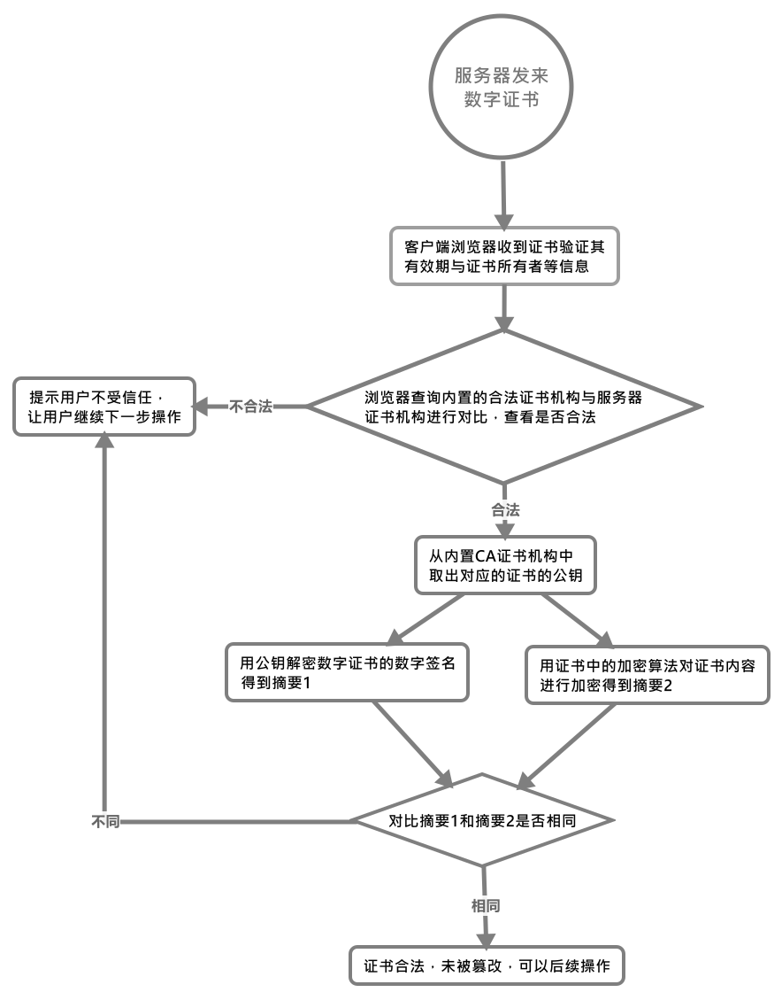

# HTTPS
`HTTPS` = `HTTP`协议 + `SSL/TLS`协议，`https`即在`http`的基础上上加上了一层`SSL/TLS`安全层.中传输数据的过程中，要通过`SSL/TLS`对报文进行加密后，中进行传输。

## 相对于HTTP的区别
由于`HTTP`协议用明文的方式来传递报文，所以基于这些缺点，`HTTPS`做出了改动，中`HTTP`协议的基础上加入了`SSL`协议，用于数据的加密和完整性验证，和对话双方的身份验证。

以下是`HTTPS`具有的特性：
1. 保护数据**完整性**：防止中间人篡改。
2. 身份**认证**：认证客户端和服务器端。
3. 内容**加密**：通过加密算法加密，防止中间人查看明文信息。
4. `HTTP`默认使用80端口进行通信，`HTTPS`默认使用443端口进行通信。

## HTTPS建立的过程
首先我们需要知道，为了保证数据的防止被窃听，我们需要对传输的数据进行加密，现在有两种加密方案：
+ 对称加密
+ 非对称加密

在这个过程中，我们会用密钥对数据进行加密。所谓**密钥其实是在加密算法中的一个参数**，加密算法根据密钥的不同会进行不同的加密。

### 对称加密与非对称加密
所谓**对称加密**，就是对数据进行加密的密钥和对加密后内容解密的密钥是**同一个密钥**；而**非对称加密**则是私钥加密后的密文，只要是公钥，都可以解密，但是反过来公钥加密后的密文，只有私钥可以解密。而私钥只有**一个人**有，而公钥可以发给**所有**的人。。

#### 如何选择加密密钥
加密方式|优点|缺点
:-|:-|:-
对称加密|计算量小、加密速度快、加密效率高|双方必须事先拥有密钥
非对称加密|安全，公钥公开，私钥自存|加密、解密速度慢

基于以上的特点，我们可以选择用非对称加密来进行对称密钥的传输，之后的数据传输过程中，再使用对称加密进行数据传输。

>这里为什么要这么做，原因是因为如果直接用对称加密，中一开始的传输过程中，对称密钥可能会被窃取，但其实即使我们用非对称加密，中传输公钥的过程中，仍然要面对一个问题，那就是公钥可能会被掉包，这时我们就需要通过一个权威的机构来保证，公钥是真实服务器的。

#### 如何安全的获取公钥，并确保公钥的安全性
为了确保公钥来自正确的服务器，而非窃听者，我们需要一个中间人来作为大家**无条件信任**的对象。这个时候，就有一个名为**CA证书发布机构**来作为这个中间人，只要是它承认的证书，那么我们就可以确认这个证书中的公钥来自于正确的服务器。

在这一切之前，服务器应该向CA机构进行认证，CA对已经过认证的服务器，会颁发一个数字证书，该数字证书包括证书所有者的信息、证书所有者的公钥、有效期、域名、颁发机构等等信息。

#### 数字证书
数字证书由以下部分组成：
- 证书发布机构
- 证书有效期
- 服务器公钥
- 证书所有者
- 数字签名所用算法
- 指纹算法，用于计算摘要

#### 验证证书的合法性与完整性
当服务器向客户端发送通过CA认证后的证书时，客户端浏览器会做以下的验证：
1. 浏览器取出证书，验证其中的证书所有者、证书有效期等信息。
2. 浏览器查询内置的受信任的证书发布机构CA，与服务器中的证书机构进行对比，查看是否为合法机构颁发的证书。
   1. 如果没找到，则报错，说明这个证书是不受信任的证书，至此结束
3. 如果找到了，则从中浏览器操作系统中取出该证书的公钥，对证书中的数字签名进行解密，得到摘要1
4. 浏览器再用证书中的加密算法对证书的内容进行求值，得出摘要2
5. 将摘要1和摘要2进行对比，相同则说明证书合法，未被篡改。

通过上述步骤后，浏览器就会从证书内容中取出公钥，用于后续加密了。

[部分参考](https://blog.51cto.com/11883699/2160032)

基于上面的知识，现在我们可以来看看，HTTPS是如何建立的：
1. 客户端向服务器端发送client hello，其中包括以下信息：
   1. 客户端支持的加密协议的版本
   2. 一个客户端生成的随机值，用于协商对话密钥
   3. 支持的加密算法，如RSA公钥加密
2. 服务器端收到消息后，返回一个server hello，其中包括以下信息：
   1. 加密协议的版本
   2. 一个服务器生成的随机值，用于协商对话密钥
   3. 确认使用的加密算法
   4. 服务器端证书
3. 客户端收到服务器端响应后，验证证书的合法性和完整性[详情](#%e5%a6%82%e4%bd%95%e5%ae%89%e5%85%a8%e7%9a%84%e8%8e%b7%e5%8f%96%e5%85%ac%e9%92%a5%e5%b9%b6%e7%a1%ae%e4%bf%9d%e5%85%ac%e9%92%a5%e7%9a%84%e5%ae%89%e5%85%a8%e6%80%a7)
4. 当证书没问题时，客户端取出证书中的公开密钥加密以下信息，然后向服务器端发送：
   1. 一个随机数。该随机数用服务器公钥加密，防止被窃听，用于协商对话密钥
   2. 编码更改通知，告知服务器端之后的对话将使用双方协商的加密方法和密钥
   3. 客户端握手结束通知，表示客户端握手阶段已经结束。
5. 服务器端使用私钥解密第三个随机数，用之前两个随机数与协商的加密算法生成本次会话使用的对称密钥，然后服务器端向客户端发送握手结束通知
6. 客户端与服务器端开始https通信。

[参考](http://www.ruanyifeng.com/blog/2014/02/ssl_tls.html)

## TLS与SSL
SSL：（Secure Socket Layer，安全套接字层），位于可靠的面向连接的网络层协议和应用层协议之间的一种协议层。SSL通过互相认证、使用数字签名确保完整性、使用加密确保私密性，以实现客户端和服务器之间的安全通讯。该协议由两层组成：SSL记录协议和SSL握手协议。

TLS：（Transport Layer Security，传输层安全协议），用于两个应用程序之间提供保密性和数据完整性。该协议由两层组成：TLS记录协议和TLS握手协议。

### 关系
SSL是Netscape开发的专门用于保护Web通讯的，目前版本为3.0.最新版本的TLS 1.0是IETE（工程任务组）指定的一种新的协议，它建立在SSL 3.0协议规范之上，是SSL 3.0的**后续版本**。两者差别极小，可以理解为SSL 3.1，它是写入了RFC的。