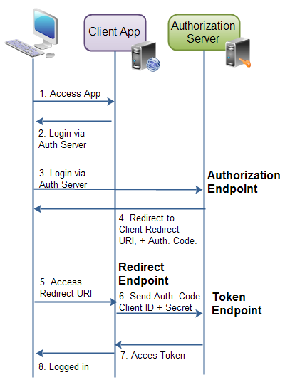

# OAuth2.0

`OAuth 2.0`是一个开放的标准协议，允许应用程序访问其它应用的用户授权的数据。例如：一个游戏可以获取`Facebook`中的用户信息，或者是一个地理位置程序可以获取`Foursquare`的用户信息等。

例如：首先用户进入游戏的`web`应用，该应用要求用户通过`Facebook`账户登录，并定向到`Facebook`的登录界面，用户登录`Facebook`后，会重定向到之前的游戏应用。此时该应用就获取到了用户在`Facebook`的用户数据以及授权信息。

## OAuth2.0组件组成

OAuth2.0一共由以下4个组件组成：

- `Resource Owner`（资源所有者）即用户，在第三方平台上的数据拥有者。
- `Resource Server`（资源服务器）即第三方平台
- `Client Application`（客户端应用）即请求登录的应用程序，它们会向资源服务器发起访问请求
- `Authorization Server`（认证服务器）即第三方认证服务器，会对客户端应用进行授权，授权通过后客户端应用就可以访问资源服务器上的资源。(认证服务器和资源服务器可以是同一个应用，也可以独立部署)


## OAuth2.0客户端类型

`OAuth2.0`规范定义了`2`种客户端类型：

- 私密型
- 公开型

私密型客户端会保存`Client Password`。认证服务器会给一个客户端生成一个`Client Password`，认证服务器通过该`Client Password`来识别该客户端服务器应用是一个注册过的应用，而不是欺诈程序。

公开型客户端不会保存`Client Password`。例如移动APP或桌面应用，因为如果它们被保存在此类应用中，就可以通过破解的手段拿到`Client Password`，这样就不安全。

## 客户端应用的表现形式

客户端应用一共有三种呈现方式：

- `Web Application`（`web`应用）
- `User Agent`（富`web`客户端）
- `Native`（原生应用）

### Web Application

`web`程序运行在`web`服务器上。`web`应用做认证时用到的`client password`是保存在服务器上的，因此是私密的。下面是一个`web`应用的示例图：


### User Agent Application

富`web`客户端应用是指由`Javascript`构建的`web`应用，浏览器是客户端代理。这类应用的特点是，程序是存放在`web`服务器上的，但是运行时，浏览器下载`Javascript`程序到本地，直接在浏览器中执行，例如那些用`Javascript`开发的网页版游戏。下面是一个富`web`客户端的示例图：


### Native

（注：这里指**没有后端服务器的应用**，一次所有的数据和配置只能存放在客户端程序中）
原生应用包括移动`APP`和桌面程序。原生应用直接安装在用户的设备上（电脑或手机、平板），`client password`会保存在用户的设备里。


## OAuth2.0认证步骤

当一个客户端应用要访问资源服务器上的资源时，需要先获取到**认证授权**。

### 客户端ID，客户端密码与重定向URI

客户端应用需要在认证让我去上注册，注册完成后，认证服务器会生成这个应用的`client id`与`cilent password`。则两个字段在同一个认证服务器中是唯一的。(当然客户端应用也可以在多个认证服务器中注册)当客户端应用需要访问资源服务器上的资源时，首选要通过认证服务器进行认证，认证时要发送对应的`client id`与`client password`到认证服务器。

客户端应用在认证服务器进行注册时，需要填写一个重定向`URI`。当资源所有者对客户端应用进行授权成功后，资源所有者会被重定向`URI`指向的页面。

## 认证授权模式

资源所有者会给客户端应用认证授权，认证授权时需要认证服务器和资源服务器进行配合。

`OAuth 2.0`规范列举了`4`中认证授权方式，每种方式都有不同的安全特点：

- `Authorization Code`（授权码模式）
- `Implicit`（简化模式）
- `Resource Owner Password Credentials`（用户密码模式）
- `Client Credentials`

### Authorization Code

该模式的认证过程如下：

1. 资源所有者进入客户端应用
2. 客户端应用让用户通过认证服务器进行登录
3. 登录之前，客户端应用将用户重定向到认证服务器的登录界面，同时把`client id`发送到认证服务器，这样认证服务器就知道是哪一个客户端应用在请求认证授权。
4. 用户在认证服务器上进行登录，登录成功后，会提示用户是否要对客户端应用进行授权，用户选择同意后，会被重定向到客户端应用。
5. 当重定向回客户端应用时，使用的是客户端应用在认证服务器上注册时填写的重定向URI，同时认证服务器会发送一个代表此次认证过程的一个授权码。
6. 当成功重定向到客户端应用后，客户端应用会在后台与认证服务器进行交互，将上个步骤中获取到的授权码，连同`client id`,`client password`发送给认证服务器。
7. 认证服务器对收到的数据进行校验，通过后发送`access token`给客户端应用。
8. 这时客户端应用就可以用接收到的`access token`去资源服务器访问相关资源。

下面是一个示例图：


### Implicit（简化模式）

`Implicit`（简化模式）与`Authorization Code`（授权码模式）类似，区别仅在于当用户成功登录之后，重定向到客户端应用时，`access token`会直接返回给客户端应用。

**这意味着`access token`在客户端应用中是可见的。而`Authorization Code`（授权码模式），`access token`是在`web`服务器中的，对客户端来说不可见**。这是这两种模式的最大区别。

并且，客户端应用只发送`client id`到认证服务器。如果连同`client password`一起发送的话，`client password`需要存储在客户端应用中，这会是一个安全隐患，很容易通过破解手段拿到存放在客户端应用程序中的`client password`。

下面是一个示例图：


### Resource Owner Password Credentials

`Resource Owner Password Credentials`（密码模式）允许客户端应用直接使用用户的用户名和密码。例如用户可以直接在客户端应用中录入`Twitter`的用户名和密码。

只有在充分信任客户端应用的情况下，才能使用密码模式。（因为用户名和密码是在客户端应用中录入的，因此客户端应用可以获取并保存用户的用户名和密码）。

密码模式一般在富`web`客户端应用和原生应用中使用。

### Client Credentials（客户端模式）

`Client Credentials`模式用于访问跟用户无关的资源，因此不需要用户授权。

## OAuth2.0节点

`OAuth2.0`定义了节点集合。一个节点一般就表示`web`服务器上的一个`URI`，具体包括：

- 认证节点
- `Token`节点
- 重定向节点

认证节点和`Token`节点在认证服务器上，重定向节点在客户端应用上。



OAuth 2.0规范并没有对节点的URL做出明确的定义，不同的实现会提供不同的URL。

### 认证节点

认证节点是用户进行登录操作的地址。

### Token节点

`Token`节点是认证服务器提供的，让客户端应用获取`access token`的地址。

### 重定向节点

重定向节点在客户端应用中，用户成功登录后，会被重定向到此地址。

## OAuth2.0请求和响应

当客户端应用请求`access token`时，会发送`http`请求到认证服务器。不同的认证授权类型会有不同的请求和响应内容。认证授权类型有4种：

- `Authorization Code`（授权码模式）
- `Implicit`（简化模式）
- `Resource Owner Password Credentials`（用户密码模式）
- `Client Credentials`

每种类型的请求和响应内容会在后续的内容中详细解释。

### Authorization Code的请求和响应

授权码模式有2个请求和2个响应：

- 认证请求＋响应
- `access token`请求＋响应。

**授权请求**发送到认证服务器，然后会获得一个授权码：

```js
response_type   必选项，固定值为 "code"
client_id   必选项, 客户端应用在认证服务器注册时生成的client id
redirect_uri    可选项. T客户端应用在认证服务器注册时填写的重定向URL地址
scope   可选项. 请求的权限范围
state   可选项 (建议提供). 客户端应用的请求URL中的参数，可以是任意值
```

**授权响应**含有授权码，这个授权码在后续获取`access token`时需要提供。

```js
code    必选项. 认证服务器返回的授权码.
state   必选项, 如果客户端应用的请求中有这个参数，既为这个参数的值
```

**授权错误响应**，错误的形式一共有两种：

- 客户端应用验证失败，例如授权请求中发送的重定向`URL`与客户端应用在认证服务器中注册时填写的`URL`不一致。

- 产生了其它错误，此时下面的错误信息会返回给客户端应用：

```js
error   必选。 Must be one of a set of predefined error codes. See the specification for the codes and their meaning.
error_description   Optional. A human-readable UTF-8 encoded text describing the error. Intended for a developer, not an end user.
error_uri   Optional. A URI pointing to a human-readable web page with information about the error.
state   必选，if present in authorization request. The same value as sent in the state parameter in the request.
```

**Token请求**，客户端应用获取到授权码后，可以用此授权码去获取`access token`，请求携带的参数如下：

```js
client_id   必选。 The client application's id.
client_secret   必选。 The client application's client secret .
grant_type  必选。 Must be set to authorization_code .
code    必选。 The authorization code received by the authorization server.
redirect_uri    必选， if the request URI was included in the authorization request. Must be identical then.
```

**Token响应**，`access token`的响应内容应为`JSON`格式的：

```js
{
    "access_token": "...", // 访问令牌
    "token_type": "...", // 令牌类型，一般为bearer
    "expires_in": "...", // 以秒为单位的令牌失效时间
    "refresh_token": "...", // 当令牌访问失效时，可以用此令牌获取一个新的令牌访问
}
```

### Implict的请求和响应

简化模式只有一个请求和响应：

**简化模式授权请求**，参数如下：

```js
response_type   Required. Must be set to token .
client_id   Required. The client identifier as assigned by the authorization server, when the client was registered.
redirect_uri    Optional. The redirect URI registered by the client.
scope   Optional. The possible scope of the request.
state   Optional (recommended). Any client state that needs to be passed on to the client request URI.
```

**简化模式授权响应**，响应包含以下参数，注意该响应的格式不是json的：

```js
access_token    Required. The access token assigned by the authorization server.
token_type  Required. The type of the token
expires_in  Recommended. A number of seconds after which the access token expires.
scope   Optional. The scope of the access token.
state   Required, if present in the autorization request. Must be same value as state parameter in request.
```

**简化模式的错误反馈**，同[`Code`模式](#authorization-code%e7%9a%84%e8%af%b7%e6%b1%82%e5%92%8c%e5%93%8d%e5%ba%94)

### 用户密码模式的请求和响应

用户密码模式也只有一个请求和响应：

**用户密码模式的请求**，包含以下参数：

```js
grant_type  必选项. 固定值 "password"
username    必选项. UTF-8编码的用户名.
password    必选项. UTF-8编码的密码.
scope   可选项. 请求的权限范围.
```

**用户密码模式的响应**，包含以下参数：

```js
{
    "access_token"  : "...", // 访问令牌,
    "token_type"    : "...", // 令牌类型,
    "expires_in"    : "...", // 以秒为单位的令牌失效时间,
    "refresh_token" : "...", // 当访问令牌失效时，可以用更新令牌获取一个新的访问令牌
}
```

### 客户端模式的请求和响应

同上，只有一个请求和响应

**请求**包含以下参数：

```js
grant_type  必选项. 固定值 "client_credentials".
scope   可选项. 请求的权限范围.
```

**响应**包含以下参数：

```js
{
    "access_token"  : "...", // 访问令牌,
    "token_type"    : "...", // 令牌类型,
    "expires_in"    : "..." // 以秒为单位的令牌失效时间
}
```

[OAuth 2.0 Tutorial 原文](http://tutorials.jenkov.com/oauth2/index.html)
[OAuth 2.0 教程 译文](https://blog.csdn.net/haiyan_qi/article/details/52433206)
